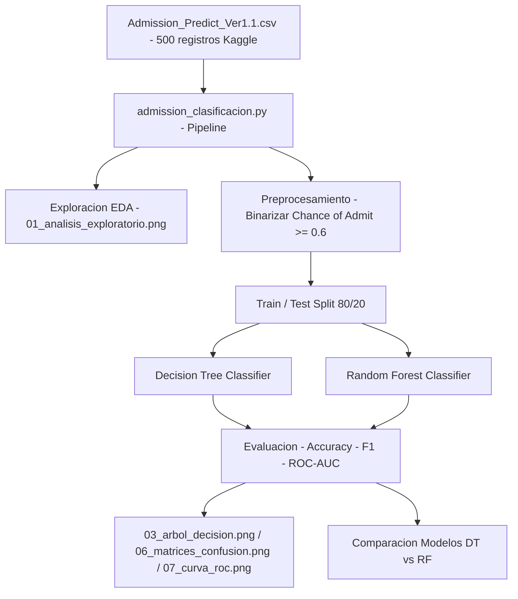

<div align="center">

# 🎓 Predictive Modeling of Graduate Admissions using Tree-Based Algorithms

</div>

<div align="center">


**Aprendizaje Automático y Minería de Datos**  
**Fundación Universitaria Internacional de La Rioja — 2026**

*Clasificación supervisada de candidatos a posgrado mediante Decision Tree y Random Forest*

</div>

---

## 📋 Tabla de Contenido

- [Descripción del Proyecto](#-descripción-del-proyecto)
- [Dataset](#-dataset)
- [Estructura del Repositorio](#-estructura-del-repositorio)
- [Pipeline del Análisis](#-pipeline-del-análisis)
- [Modelos Implementados](#-modelos-implementados)
- [Resultados](#-resultados)
- [Gráficos Generados](#-gráficos-generados)
- [Instalación y Ejecución](#-instalación-y-ejecución)
- [Conclusiones](#-conclusiones)
- [Tecnologías](#-tecnologías)
- [Autor](#-autor)

---

## 🚀 Descripción del Proyecto

Este proyecto aplica técnicas de **clasificación supervisada** sobre el dataset *Graduate Admissions* para predecir si un candidato tiene alta probabilidad de ser admitido en un programa de posgrado.

La variable continua `Chance of Admit` se transforma en una **variable binaria**:

```
Admit = "yes"  →  si Chance of Admit ≥ 0.6
Admit = "no"   →  si Chance of Admit < 0.6
```

Se implementan y comparan dos algoritmos basados en árboles:
- 🌳 **Decision Tree Classifier**
- 🌲 **Random Forest Classifier**

El análisis sigue un pipeline completo: exploración → preprocesamiento → modelado → evaluación → interpretación.

---

## 📊 Dataset

| Atributo | Detalle |
|---|---|
| **Fuente** | [Kaggle - Graduate Admissions](https://www.kaggle.com/mohansacharya/graduate-admissions) |
| **Registros** | 500 candidatos |
| **Variables** | 9 (8 predictoras + 1 objetivo) |
| **Missing values** | ✅ Ninguno |
| **Tipo de problema** | Clasificación binaria supervisada |

### Variables del Dataset

| Variable | Tipo | Descripción |
|---|---|---|
| `GRE Score` | int | Puntaje GRE (290–340) |
| `TOEFL Score` | int | Puntaje TOEFL (92–120) |
| `University Rating` | int | Calificación de la universidad (1–5) |
| `SOP` | float | Calidad del Statement of Purpose (1–5) |
| `LOR` | float | Calidad de la carta de recomendación (1–5) |
| `CGPA` | float | Promedio académico acumulado (6.8–9.92) |
| `Research` | int | Experiencia investigativa (0 o 1) |
| `Chance of Admit` | float | Probabilidad de admisión (0.34–0.97) → **variable objetivo** |

### Distribución de Clases

```
yes (≥ 0.6)  →  405 registros  →  81%
no  (< 0.6)  →   95 registros  →  19%
```

> ⚠️ Desbalance moderado. No crítico, pero influye en métricas por clase.

---

## 📁 Estructura del Repositorio

```
📦 Predictive-Modeling-of-Graduate-Admissions-using-Tree-Based-Algorithms
├── 📄 admission_clasificacion.py                      # Script principal — pipeline completo
├── 📊 Admission_Predict_Ver1.1.csv                    # Dataset principal (500 registros)
├── 📊 Admission_Predict.csv                           # Dataset versión anterior (400 registros)
├── 📄 Desarrollo_Proyecto_Alejandro_De_Mendoza.pdf    # Informe técnico completo
├── 🖼️ 01_analisis_exploratorio.png                    # EDA: distribuciones y scatter plots
├── 🖼️ 02_correlacion.png                              # Matriz de correlación de Pearson
├── 🖼️ 03_arbol_decision.png                           # Visualización del árbol entrenado
├── 🖼️ 04_importancia_dt.png                           # Feature importance — Decision Tree
├── 🖼️ 05_importancia_rf.png                           # Feature importance — Random Forest
├── 🖼️ 06_matrices_confusion.png                       # Matrices de confusión comparadas
├── 🖼️ 07_curva_roc.png                                # Curva ROC — comparación de modelos
└── 📄 README.md                                       # Este archivo
```

---

## 🔄 Pipeline del Análisis

```
┌─────────────────────────────────────────────────────────────────┐
│                     PIPELINE COMPLETO                           │
├─────────────┬──────────────┬──────────────┬─────────────────────┤
│  1. CARGA   │  2. EDA      │  3. PREPRO   │  4. MODELADO        │
│             │              │              │                     │
│  CSV →      │  Estadís-    │  Binarizar   │  Decision Tree      │
│  DataFrame  │  ticas desc. │  variable    │  Random Forest      │
│  Strip cols │  Correlación │  Encode y    │  Train 70%          │
│  Shape      │  Scatter     │  split 70/30 │  Test  30%          │
│  isnull     │  Histogramas │  Stratify    │  Stratified         │
├─────────────┴──────────────┴──────────────┴─────────────────────┤
│                     5. EVALUACIÓN                               │
│  Accuracy │ AUC-ROC │ Conf. Matrix │ Class. Report │ CV 5-fold  │
└─────────────────────────────────────────────────────────────────┘
```

---

## 🤖 Modelos Implementados

### 🌳 Decision Tree Classifier

```python
DecisionTreeClassifier(
    criterion='gini',       # Índice de Gini como medida de impureza
    max_depth=4,            # Profundidad máxima → evita sobreajuste
    min_samples_leaf=10,    # Mínimo 10 muestras por hoja
    random_state=42         # Reproducibilidad garantizada
)
```

**Regla principal aprendida por el modelo:**
```
|--- CGPA <= 7.91  →  class: NO  (baja prob. de admisión)
|--- CGPA >  7.91  →  continúa evaluando GRE, TOEFL, SOP...
```

### 🌲 Random Forest Classifier

```python
RandomForestClassifier(
    n_estimators=100,       # 100 árboles en el ensemble
    max_depth=5,            # Profundidad por árbol
    min_samples_leaf=5,     # Regularización por hoja
    random_state=42         # Reproducibilidad
)
```

**Predicción final:**
```
P(Admit=yes) = (1/100) × Σ Pb(yes)   →  votación mayoritaria
```

---

## 📈 Resultados

### Tabla Comparativa

| Métrica | 🌳 Decision Tree | 🌲 Random Forest | Mejor |
|---|---|---|---|
| **Accuracy** | 89.33% | **91.33%** | 🌲 RF |
| **AUC-ROC** | 0.8879 | **0.9054** | 🌲 RF |
| **CV Accuracy (5-fold)** | 0.8960 ± 0.0403 | **0.9080 ± 0.0312** | 🌲 RF |
| **Precision (yes)** | 0.93 | 0.92 | 🌳 DT |
| **Recall (yes)** | 0.93 | **0.98** | 🌲 RF |
| **Recall (no)** | **0.72** | 0.66 | 🌳 DT |
| **Interpretabilidad** | ⭐⭐⭐⭐⭐ | ⭐⭐ | 🌳 DT |
| **Estabilidad** | ⭐⭐⭐ | ⭐⭐⭐⭐⭐ | 🌲 RF |

### Importancia de Variables (Top 3 — ambos modelos)

```
🥇 CGPA          →  Factor dominante. Correlación 0.88 con Chance of Admit.
🥈 GRE Score     →  Criterio secundario. Especialmente en rangos intermedios de CGPA.
🥉 TOEFL Score   →  Tercer factor. Mayor relevancia en Random Forest.
```

### Interpretación Práctica Clave

> **Si CGPA ≤ 7.91 → el modelo predice NO admisión, independientemente de cualquier otra variable.**

Esto significa que el rendimiento académico acumulado es la barrera mínima para ser considerado candidato fuerte. Un GRE alto o una excelente carta de recomendación no compensan un CGPA bajo en este modelo.

---

## 🖼️ Gráficos Generados

| Gráfico | Descripción |
|---|---|
| `01_analisis_exploratorio.png` | Distribución de `Chance of Admit`, conteo de clases, scatter CGPA y GRE vs probabilidad |
| `02_correlacion.png` | Heatmap de correlación de Pearson entre todas las variables |
| `03_arbol_decision.png` | Árbol de decisión entrenado con `max_depth=4`, nodos coloreados por clase |
| `04_importancia_dt.png` | Importancia de variables por reducción de Gini — Decision Tree |
| `05_importancia_rf.png` | Importancia de variables por MDI (Mean Decrease Impurity) — Random Forest |
| `06_matrices_confusion.png` | Matrices de confusión comparadas lado a lado |
| `07_curva_roc.png` | Curva ROC con AUC para ambos modelos vs clasificador aleatorio |

---

## ⚙️ Instalación y Ejecución

### Requisitos

- Python 3.8+
- pip

### 1. Clonar el repositorio

```bash
git clone https://github.com/AlejoTechEngineer/Predictive-Modeling-of-Graduate-Admissions-using-Tree-Based-Algorithms.git
cd "Predictive-Modeling-of-Graduate-Admissions-using-Tree-Based-Algorithms"
```

### 2. Instalar dependencias

```bash
pip install pandas numpy matplotlib seaborn scikit-learn
```

### 3. Ejecutar el script

```bash
python admission_clasificacion.py
```

### 4. Output esperado

```
Columnas: ['Serial No.', 'GRE Score', 'TOEFL Score', ...]
Forma del dataset: (500, 9)
...
Árbol de Decisión - Accuracy CV: 0.8960 ± 0.0403
Random Forest     - Accuracy CV: 0.9080 ± 0.0312
¡Script completado exitosamente! Revisa los archivos PNG generados.
```

Los 7 archivos PNG se generan automáticamente en la misma carpeta.

---

## 🎯 Conclusiones

1. **CGPA es el predictor dominante** en ambos modelos. Su correlación de 0.88 con `Chance of Admit` y su posición como nodo raíz del árbol lo confirman empíricamente.

2. **Random Forest supera al Árbol de Decisión** en accuracy (91.33% vs 89.33%), AUC-ROC (0.905 vs 0.888) y estabilidad en validación cruzada (±0.031 vs ±0.040).

3. **El desbalance de clases (81/19) impacta el recall** de la clase minoritaria. El árbol individual mantiene mejor equilibrio entre clases (recall "no" = 0.72), mientras que Random Forest prioriza la clase mayoritaria (recall "no" = 0.66).

4. **Ambos modelos superan ampliamente el clasificador aleatorio** (AUC > 0.88 en ambos casos), demostrando alta capacidad discriminativa real.

5. **El árbol ofrece ventaja en interpretabilidad**: sus reglas if-else son directamente accionables por una institución educativa para diseñar criterios de preselección.

---

## 🛠️ Tecnologías

<div align="center">

| Librería | Versión | Uso |
|---|---|---|
| `pandas` | 3.0.1 | Carga, manipulación y análisis de datos |
| `numpy` | 2.4.2 | Operaciones numéricas vectorizadas |
| `matplotlib` | 3.10.8 | Visualizaciones y exportación de gráficos |
| `seaborn` | 0.13.2 | Heatmaps y visualizaciones estadísticas |
| `scikit-learn` | 1.8.0 | Modelos, métricas y validación cruzada |

</div>

---

## 👨‍💻 Autor

<div align="center">

**Alejandro De Mendoza**  
Ingeniería Informática 
Fundación Universitaria Internacional de La Rioja (UNIR)  
Bogotá D.C., Colombia — 2026

[](https://github.com/AlejoTechEngineer)

*Laboratorio desarrollado para Aprendizaje Automático y Minería de Datos*  
*Profesor: Ing. Rogerio Orlando Beltrán Castro*

</div>

---

<div align="center">

⭐ **Si este proyecto te fue útil, dale una estrella al repo** ⭐

*Made with 🧠 + ☕ + Python*

</div>
## Arquitectura


